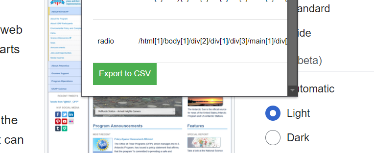
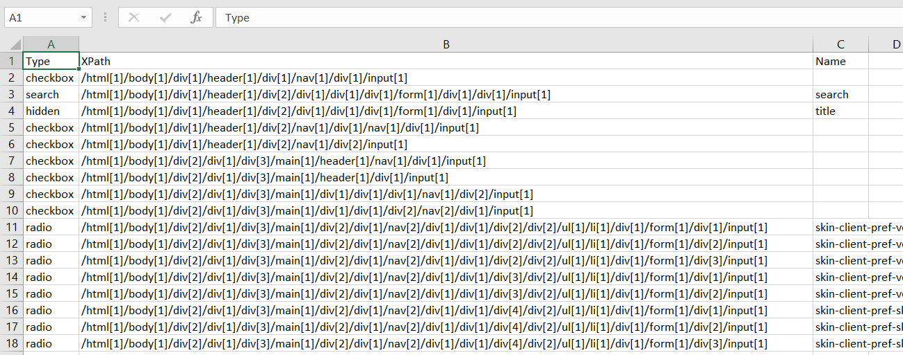

# XElement: Input Field Detector for Webpages

**XElement** is a Chrome extension that scans any webpage for input fields (`<input>`, `<textarea>`, `<select>`) and exports their details into a CSV file. It is an essential tool for **software testers**, **QA engineers**, and **web developers** for validating form elements and maintaining detailed records.

---

## Features

- **Automatic Field Detection**: Identifies all input fields (text boxes, dropdowns, and text areas) on a webpage.
- **Detailed Information**: Captures essential data such as the field's **type**, **XPath**, and **name**.
- **CSV Export**: Saves the detected fields into a CSV file for further analysis and documentation.

---

## Installation

1. **Clone or Download the Project**:
   ```bash
   git clone https://github.com/your-repo/xelement.git
   ```
2. **Load the Extension**:
   - Open [Chrome Extensions Page](chrome://extensions/).
   - Enable **Developer Mode**.
   - Click **Load Unpacked** and select the project directory.

---

## Usage

1. **Navigate to a Webpage**: Open the webpage containing input fields you want to detect.
2. **Open XElement Popup**:
   - Click the **XElement** icon in the Chrome toolbar.
   - View the list of detected fields in the popup.
3. **Export the Results**:
   - Click **Export to CSV** in the popup to download a CSV file containing the input field details.

---

## Project Structure

```
xelement/
├── manifest.json      # Chrome extension configuration file
├── content.js         # Script to detect input fields and generate their XPath
├── popup.html         # User interface for the popup
├── popup.js           # Handles interactions between popup and content script
├── icons/             # Folder containing extension icons
│   └── icon.png
```

---

## How It Works

1. **Field Detection**:  
   When the extension is activated, a background content script scans the webpage for all `<input>`, `<textarea>`, and `<select>` elements. Each field's **type**, **XPath**, and **name** are captured for analysis.

2. **XPath Generation**:  
   Each input field is uniquely identified using an algorithm to construct its **XPath**, ensuring precise targeting.

3. **Export to CSV**:  
   After detecting the fields, the extension formats the data and allows users to export it into a structured CSV file.

---

## Benefits for Software Testers

- **Efficiency**: Quickly gather input field details without manual effort.
- **Accurate Testing**: Use the exported XPath data to design automated test cases.
- **Documentation**: Maintain detailed records of input fields for form validation.

---

## Screenshots

### Popup Interface
The extension popup provides a clean, organized table of detected input fields.


<br>



### Exported CSV
The exported CSV file includes all essential details, ready for use in testing and analysis.



---

## Contributions

We welcome contributions to improve **XElement**. To contribute:
1. Fork this repository.
2. Create a new branch for your feature or bug fix.
3. Submit a pull request with detailed explanations.

---

## Limitations

- Detects only basic form elements (`<input>`, `<textarea>`, `<select>`).
- Requires refreshing the webpage to activate the content script after installation.

---

## License

This project is open-source and available under the MIT License. See the [LICENSE](LICENSE) file for more information.

---

## Support

For questions, issues, or feature requests, please open an issue on GitHub or reach out via email.

**XElement** makes form field detection seamless for testing professionals—download and simplify your workflow today!

--- 